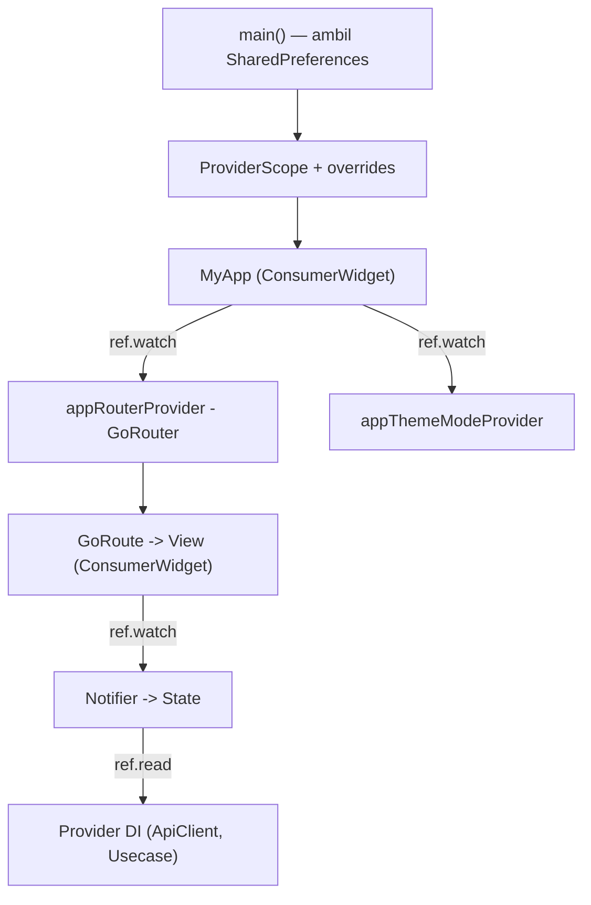

# Panduan Riverpod untuk Flutter Generator Pro

Dokumen ini menjelaskan arsitektur **Riverpod 3.x + go_router** yang dihasilkan oleh generator, khusus ditujukan untuk developer yang terbiasa dengan **GetX** dan ingin beralih.

> Ringkas: **GetX** menyatukan state + DI + routing dalam satu paket. **Riverpod** fokus ke **state + dependency injection**, sedangkan **routing** ditangani `go_router` secara terpisah.

---

## Daftar Isi

- [Versi Package](#versi-package)
- [Filosofi Dasar](#filosofi-dasar)
- [Struktur Folder](#struktur-folder)
- [Konsep Inti](#konsep-inti)
- [Peta Padanan GetX to Riverpod](#peta-padanan-getx--riverpod)
- [State + Notifier](#state--notifier)
- [View: ConsumerWidget](#view-consumerwidget)
- [Dependency Injection](#dependency-injection)
- [Routing dengan go_router](#routing-dengan-go_router)
- [Theme](#theme)
- [Alur Aplikasi](#alur-aplikasi)
- [Code Generation](#code-generation)
- [Testing](#testing)
- [Cheat Sheet](#cheat-sheet)

---

## Versi Package

```yaml
dependencies:
  flutter_riverpod: ^3.3.2
  riverpod_annotation: ^4.0.3
  go_router: ^17.3.0

dev_dependencies:
  build_runner: ^2.15.1
  riverpod_generator: ^4.0.4
  riverpod_lint: ^3.1.4
  flutter_lints: ^6.0.0
```

> Catatan Riverpod 3.0: `Ref` sudah **unified** — tidak ada lagi `FooRef`. Provider fungsional cukup memakai `Ref ref`.

---

## Filosofi Dasar

| GetX | Riverpod |
|------|----------|
| Satu paket untuk state + DI + routing + utils | Riverpod = state + DI. Routing pakai `go_router` |
| Controller hidup/mati ikut Binding + navigasi | Provider hidup/mati ikut siapa yang `watch` + `keepAlive` |
| State reaktif = `.obs` + `Obx()` | State reaktif = objek `state` + `ref.watch()` |
| Ambil dependency = `Get.find<T>()` (runtime) | Ambil dependency = `ref.read/watch` (compile-time safe) |

---

## Struktur Folder

```
lib/
├── core/
│   ├── const/app_constants.dart
│   ├── error/
│   │   ├── failures.dart              # Freezed union Failure
│   │   └── exceptions.dart
│   ├── navigation/
│   │   ├── tab_navigation_state.dart
│   │   └── tab_navigation_provider.dart
│   ├── network/
│   │   ├── api_client.dart
│   │   └── api_client_provider.dart   # provider global ApiClient
│   ├── router/
│   │   ├── route_paths.dart           # konstanta path
│   │   └── app_router.dart            # GoRouter (provider)
│   └── theme/
│       ├── app_theme.dart             # ThemeData light/dark
│       └── theme_provider.dart        # Notifier ThemeMode
├── data/
│   ├── model/
│   ├── repository_impl/
│   └── source/
├── domain/
│   ├── entity/
│   ├── repository/
│   └── usecase/
├── presentation/
│   ├── splash/
│   │   ├── providers/splash_provider.dart
│   │   └── views/splash_view.dart
│   └── dashboard/
│       ├── states/dashboard_state.dart
│       ├── providers/dashboard_provider.dart
│       └── views/dashboard_view.dart
├── shared/
│   ├── auth/auth_provider.dart        # state auth global (keepAlive)
│   └── providers/
│       └── shared_preferences_provider.dart
└── main.dart
```

Per page dihasilkan **3 file**: `states/` (data), `providers/` (logic/Notifier), `views/` (UI). Ini menggantikan pola lama `bindings/ + controllers/ + views/` dari GetX (folder `bindings/` tidak ada lagi).

---

## Konsep Inti

Riverpod punya beberapa jenis provider. Yang dipakai generator:

- **Notifier (`@riverpod class X extends _$X`)** → mengelola state + logic (pengganti `GetxController`).
- **Functional provider (`@riverpod T x(Ref ref)`)** → menyediakan dependency (pengganti `Get.put`/`Get.lazyPut`).
- **`@Riverpod(keepAlive: true)`** → provider global yang tidak auto-dispose (pengganti `Get.put(..., permanent: true)`).

---

## Peta Padanan GetX to Riverpod

| GetX | Riverpod |
|------|----------|
| `GetMaterialApp` | `ProviderScope` + `MaterialApp.router` |
| `GetPage` + `Binding` | `GoRoute` (tanpa binding) |
| `GetxController` | `@riverpod` Notifier |
| `.obs` / `.value` | field di `state` / `copyWith` |
| `Obx(() => ...)` | `ref.watch(provider)` |
| `GetView<T>` | `ConsumerWidget` |
| `Get.find<T>()` | `ref.read(xxxProvider)` |
| `Get.put(permanent: true)` | `@Riverpod(keepAlive: true)` |
| `Get.lazyPut` | provider biasa (auto lazy) |
| `Get.toNamed()` | `context.push()` |
| `Get.offAllNamed()` | `context.go()` |
| `Get.back()` | `context.pop()` |
| `GetxService` | `keepAlive` Notifier |
| `onInit` / `onClose` | `build()` / `ref.onDispose` |
| `Get.arguments` | `GoRouterState.extra` |

---

## State + Notifier

Di GetX, state dan logic menyatu di controller. Di Riverpod, **state dipisah** dari Notifier.

**GetX:**
```dart
class DashboardController extends GetxController {
  final count = 0.obs;             // state
  void increment() => count.value++; // logic
}
```

**Riverpod:**
```dart
// states/dashboard_state.dart — data saja (immutable, @freezed)
import 'package:freezed_annotation/freezed_annotation.dart';

part 'dashboard_state.freezed.dart';

@freezed
abstract class DashboardState with _$DashboardState {
  const factory DashboardState({
    @Default(0) int count,
  }) = _DashboardState;
}

// providers/dashboard_provider.dart — logic
@riverpod
class Dashboard extends _$Dashboard {
  @override
  DashboardState build() => const DashboardState(); // initial state (mirip onInit)

  void increment() => state = state.copyWith(count: state.count + 1);
}
```

Poin penting:
- `build()` mengembalikan **state awal**.
- Mengubah state = **assign `state` baru** via `copyWith` (bukan mutasi in-place).
- Untuk state sederhana (mis. counter murni), boleh langsung `int build() => 0;` tanpa class state.

---

## View: ConsumerWidget

**GetX:**
```dart
class DashboardView extends GetView<DashboardController> {
  Widget build(context) => Obx(() => Text('${controller.count}'));
}
```

**Riverpod:**
```dart
class DashboardView extends ConsumerWidget {
  const DashboardView({super.key});

  @override
  Widget build(BuildContext context, WidgetRef ref) {
    final theme = Theme.of(context);
    final state = ref.watch(dashboardProvider);          // seperti Obx + controller
    final notifier = ref.read(dashboardProvider.notifier); // akses method

    return Scaffold(
      body: Center(
        child: Text(
          'Count: ${state.count}',
          style: theme.textTheme.headlineMedium,
        ),
      ),
      floatingActionButton: FloatingActionButton(
        onPressed: notifier.increment,
        child: const Icon(Icons.add),
      ),
    );
  }
}
```

Aturan `ref.watch` vs `ref.read`:
- **`ref.watch`** → di dalam `build()`, subscribe + rebuild otomatis (seperti `Obx`).
- **`ref.read`** → di callback (`onPressed`, dsb), baca sekali tanpa subscribe.

---

## Dependency Injection

**GetX (Binding):**
```dart
class InitialBinding implements Bindings {
  void dependencies() {
    Get.smartLazyPut<ApiClient>(() => ApiClient(), fenix: true);
    Get.put(AuthService(), permanent: true);
  }
}
final api = Get.find<ApiClient>();
```

**Riverpod (provider global):**
```dart
@Riverpod(keepAlive: true)
ApiClient apiClient(Ref ref) => ApiClient();

// pakai di mana saja:
final api = ref.read(apiClientProvider);
```

`SharedPreferences` (async) di-inject via override di `main()`:
```dart
@Riverpod(keepAlive: true)
SharedPreferences sharedPreferences(Ref ref) =>
    throw UnimplementedError('override di main()');

// main.dart
final prefs = await SharedPreferences.getInstance();
runApp(
  ProviderScope(
    overrides: [sharedPreferencesProvider.overrideWithValue(prefs)],
    child: const MyApp(),
  ),
);
```

Chaining untuk Clean Architecture (usecase to repository to apiClient):
```dart
@riverpod
LoginUsecase loginUsecase(Ref ref) =>
    LoginUsecase(ref.watch(authRepositoryProvider));
```

### Auto-Wiring via Usecase Generator

Jalankan `dart run flutter_generator:gen_usecase`, lalu pilih **y** saat ditanya inject. Masukkan **fitur** + **page** (page = nama method repository).

File yang di-generate (semua di `presentation/<fitur>/providers/`):

| File | Fungsi |
|------|--------|
| `auth_repository_provider.dart` | Wire `AuthRepositoryImpl` ← `apiClientProvider` (sekali per fitur) |
| `login_usecase_provider.dart` | Wire `LoginUsecase` ← `authRepositoryProvider` |
| `login_provider.dart` | Di-link otomatis jika sudah ada dari `gen_page` |

Domain (`LoginUsecase` class) dan Data (`AuthRepositoryImpl`) **tidak** import Riverpod.

---

## Routing dengan go_router

Routing tidak lagi menyatu dengan state. Semua route ada di `core/router/`.

```dart
// route_paths.dart
abstract class RoutePaths {
  static const splash = '/';
  static const login = '/login';
  static const dashboard = '/dashboard';
}

// app_router.dart
@Riverpod(keepAlive: true)
GoRouter appRouter(Ref ref) {
  return GoRouter(
    initialLocation: RoutePaths.splash,
    routes: [
      GoRoute(path: RoutePaths.splash, builder: (c, s) => const SplashView()),
      GoRoute(path: RoutePaths.dashboard, builder: (c, s) => const DashboardView()),
    ],
  );
}
```

Navigasi dari widget:
```dart
context.go(RoutePaths.dashboard);   // = Get.offAllNamed
context.push(RoutePaths.login);     // = Get.toNamed
context.pop();                      // = Get.back
```

Navigasi berbasis async (contoh splash):
```dart
class SplashView extends ConsumerWidget {
  Widget build(context, ref) {
    final theme = Theme.of(context);

    ref.listen(splashInitProvider, (prev, next) {
      next.whenOrNull(data: (_) => context.go(RoutePaths.dashboard));
    });
    return Scaffold(
      backgroundColor: theme.colorScheme.surface,
      body: const Center(child: FlutterLogo(size: 100)),
    );
  }
}
```

---

## Theme

**GetX:** `Get.changeThemeMode(...)` di `GetxController`.

**Riverpod:**
```dart
@Riverpod(keepAlive: true)
class AppThemeMode extends _$AppThemeMode {
  @override
  ThemeMode build() => ThemeMode.system;
  void toggle() =>
      state = state == ThemeMode.dark ? ThemeMode.light : ThemeMode.dark;
}

// main.dart
final themeMode = ref.watch(appThemeModeProvider);
MaterialApp.router(themeMode: themeMode, /* ... */);
```

---

## Alur Aplikasi



---

## Code Generation

Setiap Notifier/provider memakai `part 'xxx.g.dart';`. State UI memakai `part 'xxx_state.freezed.dart';`. Jalankan:

```bash
dart run build_runner build -d
# atau saat aktif mengembangkan:
dart run build_runner watch -d
```

Ini sama seperti alur **Freezed** di layer domain & error. File `*.g.dart` dan `*.freezed.dart` **jangan** di-edit manual dan boleh di-`.gitignore`.

---

## Testing

Riverpod memudahkan mocking lewat **override**:

```dart
test('increment menambah count', () {
  final container = ProviderContainer();
  addTearDown(container.dispose);

  container.read(dashboardProvider.notifier).increment();

  expect(container.read(dashboardProvider).count, 1);
});

test('login memakai mock service', () {
  final container = ProviderContainer(
    overrides: [
      apiClientProvider.overrideWithValue(MockApiClient()),
    ],
  );
  addTearDown(container.dispose);
  // ...
});
```

---

## Cheat Sheet

```
GetX                          →  Riverpod
─────────────────────────────────────────────────
GetMaterialApp                →  ProviderScope + MaterialApp.router
GetPage + Binding             →  GoRoute (tanpa binding)
GetxController                →  @riverpod Notifier
.obs / .value                 →  state / copyWith
Obx(() => ...)                →  ref.watch(provider)
GetView<T>                    →  ConsumerWidget
Get.find<T>()                 →  ref.read(xxxProvider)
Get.put(permanent: true)      →  @Riverpod(keepAlive: true)
Get.lazyPut                   →  provider biasa (auto lazy)
Get.toNamed()                 →  context.push()
Get.offAllNamed()             →  context.go()
Get.back()                    →  context.pop()
GetxService                   →  keepAlive Notifier
onInit / onClose              →  build() / ref.onDispose
Get.arguments                 →  GoRouterState.extra
```

---

## Referensi

- Riverpod: https://riverpod.dev
- go_router: https://pub.dev/packages/go_router
- Migrasi Riverpod 2 to 3: https://riverpod.dev/docs/3.0_migration
